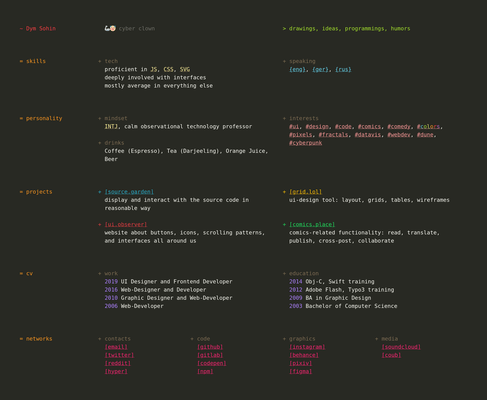
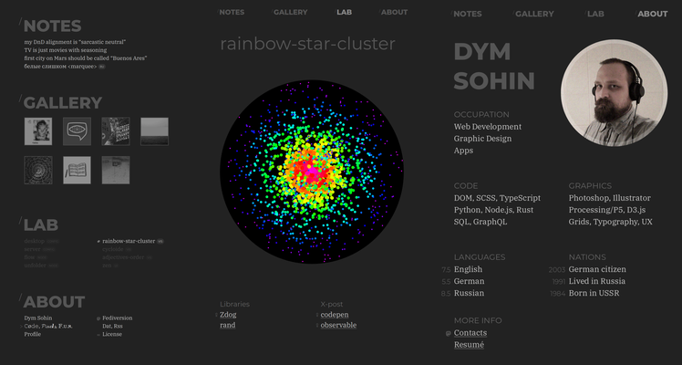
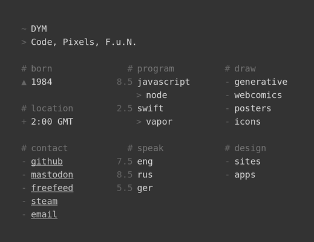
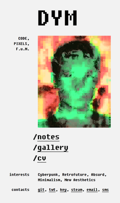
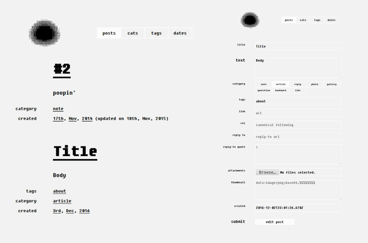
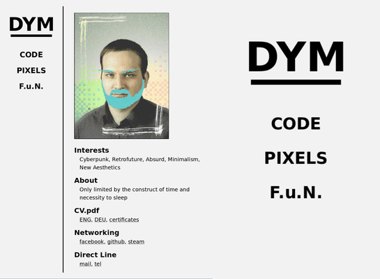
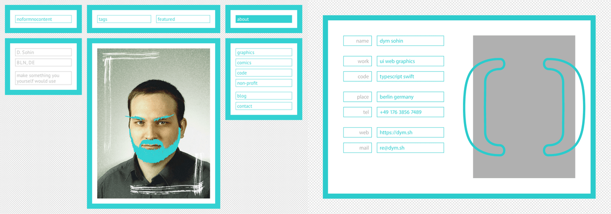

# homepages

> homepages through the ages

## years

### [2020](../homepage-2020)

### [2019](../homepage-2019)

### [2018](../homepage-2018)

### [2017](../homepage-2017)

### [2016](../homepage-2016)

### [2014](../homepage-2014)

### [2012](../homepage-2012)

## mirrors
- https://github.com/dym-sh/homepages
- https://gitlab.com/dym-sh/homepages
- https://dym.sh/homepages
- hyper://___ /[?](https://beakerbrowser.com)

## cross-posts
- https://behance.net/gallery/112273783/homepages
- https://pixiv.net/en/artworks/87347150
- https://reddit.com/r/dym_sh/comments/l66dz9
- https://instagram.com/p/CKjbLHdn1x7
- https://twitter.com/dym_sh/status/1354453923139088384

## license
[mit](./license)
